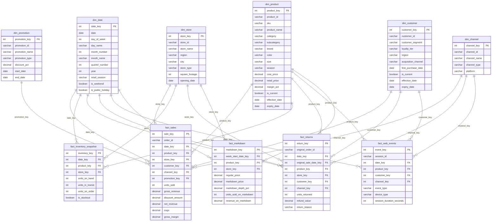

# Dimensional Model — Fashion Retail Intelligence Platform

**Version:** 1.0 | **Phase:** 1 | **Status:** Locked

All design decisions are final before data generation begins. Revisions require an explicit phase gate re-approval and a corresponding update to the metric dictionary.

---

## Business Questions by Domain

The model must answer every question below. This list is the acceptance test for completeness.

**Sales**
- Where is revenue growing or declining, and in which channels and regions?
- What is our average order value trend, and how does it vary by channel?
- Which products drive the most net revenue and gross margin?
- How does promotional discount affect revenue and margin?

**Marketing**
- Which acquisition channels bring the highest-converting customers?
- What is the conversion funnel from page view to purchase?
- What is our return rate by channel, and what are the leading return reasons?
- How does the new vs returning customer split shift across periods?

**Category Management**
- Which categories earn their space relative to floor allocation?
- Which categories have the healthiest gross margin?
- What are the top-moving products within each category this season?
- Where is markdown depth eating into category margin?

**Product Planning**
- Which SKUs need replenishment and which are overstocked?
- What is the sell-through rate by product and season, and are we hitting target?
- What does the size curve look like — are we buying the right size ratios?
- How many weeks of supply remain at the current rate of sale?

**Placement**
- Which stores or regions are understocked on key lines?
- What is the stockout rate by region, and which products are most affected?
- How is inventory distributed across the estate relative to regional demand?
- Where should we transfer or reallocate stock to maximise sell-through?

---

## Conformed Dimensions

### dim_product

**Grain:** One row per active SKU version. Price changes create a new row (Type 2).

| Column | Type | Description |
|---|---|---|
| product_key | INT | Surrogate primary key |
| product_id | VARCHAR | Natural business key (stable across versions) |
| sku | VARCHAR | Stock-keeping unit code |
| product_name | VARCHAR | Full product name |
| category | VARCHAR | Top-level category (Tops, Bottoms, Dresses, Outerwear, Footwear, Accessories) |
| subcategory | VARCHAR | Subcategory (e.g., T-Shirt, Jeans, Midi Dress, Puffer Jacket, Sneakers, Tote Bag) |
| brand | VARCHAR | Brand name |
| color | VARCHAR | Primary colour |
| size | VARCHAR | Size code (XS/S/M/L/XL/XXL or numeric for footwear) |
| season | VARCHAR | Buying season code (SS24, AW24, SS25, AW25) |
| cost_price | DECIMAL(10,2) | Wholesale unit cost |
| retail_price | DECIMAL(10,2) | Full ticket retail price |
| margin_pct | DECIMAL(5,4) | (retail_price - cost_price) / retail_price |
| is_current | BOOLEAN | TRUE for the active version of this product |
| effective_date | DATE | Date this version became active |
| expiry_date | DATE | Date this version was superseded (NULL if current) |

**SCD Strategy:** Type 2 on `retail_price`. A retail price change closes the current row (sets `expiry_date`, `is_current = FALSE`) and opens a new row. All other attributes are Type 1 (updated in place).

---

### dim_store

**Grain:** One row per physical or virtual store location.

| Column | Type | Description |
|---|---|---|
| store_key | INT | Surrogate primary key |
| store_id | VARCHAR | Natural business key |
| store_name | VARCHAR | Display name |
| region | VARCHAR | Geographic region (North, South, East, West, Midlands) |
| city | VARCHAR | City |
| country | VARCHAR | Country code (GB, US, etc.) |
| store_type | VARCHAR | Type (flagship, standard, outlet, pop_up) |
| square_footage | INT | Selling floor area in sq ft |
| opening_date | DATE | Date the store opened |

**SCD Strategy:** Type 1. Attribute corrections overwrite in place. Store closures are handled by a `closing_date` column added if needed.

---

### dim_customer

**Grain:** One row per active customer version. Segment changes create a new row (Type 2).

| Column | Type | Description |
|---|---|---|
| customer_key | INT | Surrogate primary key |
| customer_id | VARCHAR | Natural business key (stable across versions) |
| customer_segment | VARCHAR | Value segment (budget, mid_market, premium, luxury) |
| loyalty_tier | VARCHAR | Loyalty programme tier (bronze, silver, gold, platinum) |
| region | VARCHAR | Customer home region |
| city | VARCHAR | Customer home city |
| acquisition_channel | VARCHAR | Channel that acquired the customer (organic, paid_search, social, email, referral, in_store) |
| first_purchase_date | DATE | Date of first ever purchase |
| is_current | BOOLEAN | TRUE for the active version |
| effective_date | DATE | Date this version became active |
| expiry_date | DATE | Date this version was superseded (NULL if current) |

**SCD Strategy:** Type 2 on `customer_segment`. A segment reclassification closes the current row and opens a new one.

---

### dim_date

**Grain:** One row per calendar day. Statically populated from 2022-01-01 to 2027-12-31.

| Column | Type | Description |
|---|---|---|
| date_key | INT | YYYYMMDD integer primary key |
| date | DATE | Calendar date |
| day_of_week | INT | 1 (Monday) to 7 (Sunday) |
| day_name | VARCHAR | Monday … Sunday |
| day_of_month | INT | 1–31 |
| day_of_year | INT | 1–366 |
| week_of_year | INT | ISO week number (1–53) |
| month_number | INT | 1–12 |
| month_name | VARCHAR | January … December |
| quarter_number | INT | 1–4 |
| year | INT | Calendar year |
| retail_season | VARCHAR | SS (Feb–Jul) or AW (Aug–Jan) |
| calendar_season | VARCHAR | Spring, Summer, Autumn, Winter |
| is_weekend | BOOLEAN | TRUE for Saturday and Sunday |
| is_public_holiday | BOOLEAN | TRUE for UK public holidays |
| holiday_name | VARCHAR | Name of holiday, NULL otherwise |
| trading_day_of_week | INT | 1–5 for Mon–Fri, NULL on weekends (for rate of sale) |

**SCD Strategy:** Static. No history needed; the table is fully populated at build time.

---

### dim_channel

**Grain:** One row per sales/traffic channel.

| Column | Type | Description |
|---|---|---|
| channel_key | INT | Surrogate primary key |
| channel_id | VARCHAR | Natural business key |
| channel_name | VARCHAR | Display name |
| channel_type | VARCHAR | digital, physical, marketplace |
| platform | VARCHAR | own_website, instagram_shop, amazon, own_store, outlet_store, pop_up |

**SCD Strategy:** Type 1. Channels rarely change; corrections overwrite in place.

**Seed data (7 rows):**

| channel_id | channel_name | channel_type | platform |
|---|---|---|---|
| CH01 | Own Website | digital | own_website |
| CH02 | Instagram Shop | digital | instagram_shop |
| CH03 | Amazon | marketplace | amazon |
| CH04 | Flagship Store | physical | own_store |
| CH05 | Standard Store | physical | own_store |
| CH06 | Outlet Store | physical | outlet_store |
| CH07 | Pop-Up | physical | pop_up |

---

### dim_promotion

**Grain:** One row per promotional event.

| Column | Type | Description |
|---|---|---|
| promotion_key | INT | Surrogate primary key |
| promotion_id | VARCHAR | Natural business key |
| promotion_name | VARCHAR | Display name (e.g., Summer Sale 2025) |
| promotion_type | VARCHAR | pct_off, fixed_off, buy_x_get_y, free_shipping, bundle |
| discount_pct | DECIMAL(5,4) | Percentage discount (0.20 = 20%), NULL if not percentage-based |
| discount_amount | DECIMAL(10,2) | Fixed discount in currency, NULL if not fixed |
| start_date | DATE | First active date |
| end_date | DATE | Last active date |
| is_sitewide | BOOLEAN | TRUE if promotion applies to all products |

**SCD Strategy:** Type 1. A null promotion row (promotion_key = -1, promotion_name = 'No Promotion') exists for non-promoted transactions.

---

## Fact Tables

### fact_sales

**Grain:** One row per order line (one SKU on one order).

| Column | Type | Description |
|---|---|---|
| sale_key | INT | Surrogate primary key |
| order_id | VARCHAR | Order identifier (multiple lines share one order_id) |
| order_line_id | VARCHAR | Unique order line identifier |
| date_key | INT | FK → dim_date |
| product_key | INT | FK → dim_product |
| store_key | INT | FK → dim_store |
| customer_key | INT | FK → dim_customer |
| channel_key | INT | FK → dim_channel |
| promotion_key | INT | FK → dim_promotion (-1 if no promotion) |
| units_sold | INT | Quantity purchased |
| unit_retail_price | DECIMAL(10,2) | Full ticket price per unit at time of sale |
| gross_revenue | DECIMAL(12,2) | units_sold × unit_retail_price |
| discount_amount | DECIMAL(12,2) | Total discount applied to this line |
| net_revenue | DECIMAL(12,2) | gross_revenue − discount_amount |
| unit_cost | DECIMAL(10,2) | Wholesale cost per unit |
| cogs | DECIMAL(12,2) | units_sold × unit_cost |
| gross_margin | DECIMAL(12,2) | net_revenue − cogs |

**Additive measures:** all monetary and unit columns are fully additive across all dimensions.

---

### fact_inventory_snapshot

**Grain:** One row per product–store–day combination.

| Column | Type | Description |
|---|---|---|
| inventory_key | INT | Surrogate primary key |
| date_key | INT | FK → dim_date |
| product_key | INT | FK → dim_product |
| store_key | INT | FK → dim_store |
| units_on_hand | INT | Units physically in the store/warehouse |
| units_in_transit | INT | Units shipped but not yet received |
| units_on_order | INT | Units ordered from supplier, not yet shipped |
| reorder_point | INT | Configured minimum stock level |
| is_stockout | BOOLEAN | TRUE when units_on_hand = 0 |

**Semi-additive measures:** `units_on_hand`, `units_in_transit`, `units_on_order` are additive across products and stores but **not** across dates (snapshot semantics — sum by date gives a meaningless number; use latest snapshot or average).

---

### fact_returns

**Grain:** One row per return line.

| Column | Type | Description |
|---|---|---|
| return_key | INT | Surrogate primary key |
| return_id | VARCHAR | Return authorisation number |
| return_line_id | VARCHAR | Unique return line identifier |
| original_order_id | VARCHAR | Links back to fact_sales |
| date_key | INT | FK → dim_date (return processing date) |
| original_sale_date_key | INT | FK → dim_date (original purchase date) |
| product_key | INT | FK → dim_product |
| store_key | INT | FK → dim_store (return destination) |
| customer_key | INT | FK → dim_customer |
| channel_key | INT | FK → dim_channel (return channel) |
| units_returned | INT | Quantity returned |
| refund_value | DECIMAL(12,2) | Amount refunded |
| return_reason | VARCHAR | size, quality, changed_mind, damaged, wrong_item, late_delivery |

---

### fact_web_events

**Grain:** One row per web session event.

| Column | Type | Description |
|---|---|---|
| event_key | INT | Surrogate primary key |
| session_id | VARCHAR | Browser session identifier |
| event_id | VARCHAR | Unique event identifier |
| date_key | INT | FK → dim_date |
| product_key | INT | FK → dim_product (NULL for non-product pages) |
| customer_key | INT | FK → dim_customer (NULL for anonymous) |
| channel_key | INT | FK → dim_channel (traffic source) |
| event_type | VARCHAR | page_view, product_view, add_to_cart, checkout_start, purchase, abandon_cart |
| device_type | VARCHAR | mobile, desktop, tablet |
| session_duration_seconds | INT | Total session length in seconds |

**Note:** Conversion and funnel metrics are derived by aggregating event_type counts at session grain using CTEs in the mart layer, not stored as pre-aggregated columns.

---

### fact_markdown

**Grain:** One row per product–store–week.

| Column | Type | Description |
|---|---|---|
| markdown_key | INT | Surrogate primary key |
| week_start_date_key | INT | FK → dim_date (Monday of the week) |
| product_key | INT | FK → dim_product |
| store_key | INT | FK → dim_store |
| regular_price | DECIMAL(10,2) | Full ticket price for the week |
| markdown_price | DECIMAL(10,2) | Effective selling price after markdown |
| markdown_depth_pct | DECIMAL(5,4) | (regular_price − markdown_price) / regular_price |
| units_sold_on_markdown | INT | Units sold at the markdown price this week |
| revenue_on_markdown | DECIMAL(12,2) | units_sold_on_markdown × markdown_price |

---

## Entity Relationship Diagram

---

## SCD Strategy Summary

| Dimension | Strategy | Tracked attribute(s) |
|---|---|---|
| dim_product | Type 2 | retail_price |
| dim_store | Type 1 | All attributes (corrections only) |
| dim_customer | Type 2 | customer_segment |
| dim_date | Static | N/A — fully pre-populated |
| dim_channel | Type 1 | All attributes (corrections only) |
| dim_promotion | Type 1 | All attributes (corrections only) |

**Type 2 mechanics:** Closing a row sets `expiry_date = change_date - 1 day` and `is_current = FALSE`. The new row sets `effective_date = change_date` and `is_current = TRUE`. Fact tables join to the dimension using the surrogate key that was current at the time of the transaction, which is the standard approach for maintaining historical accuracy.

---

## Mart-to-Domain Mapping

| Mart | Primary fact(s) | Joined dimensions | Business owner |
|---|---|---|---|
| mart_sales | fact_sales | all six dimensions | Commercial director |
| mart_marketing | fact_sales, fact_returns, fact_web_events | dim_date, dim_customer, dim_channel, dim_product | Marketing director |
| mart_category | fact_sales, fact_inventory_snapshot, fact_markdown | dim_date, dim_product, dim_store | Category managers |
| mart_product_planning | fact_inventory_snapshot, fact_sales | dim_date, dim_product, dim_store | Buying and planning team |
| mart_placement | fact_inventory_snapshot, fact_sales | dim_date, dim_product, dim_store | Allocation and distribution team |
